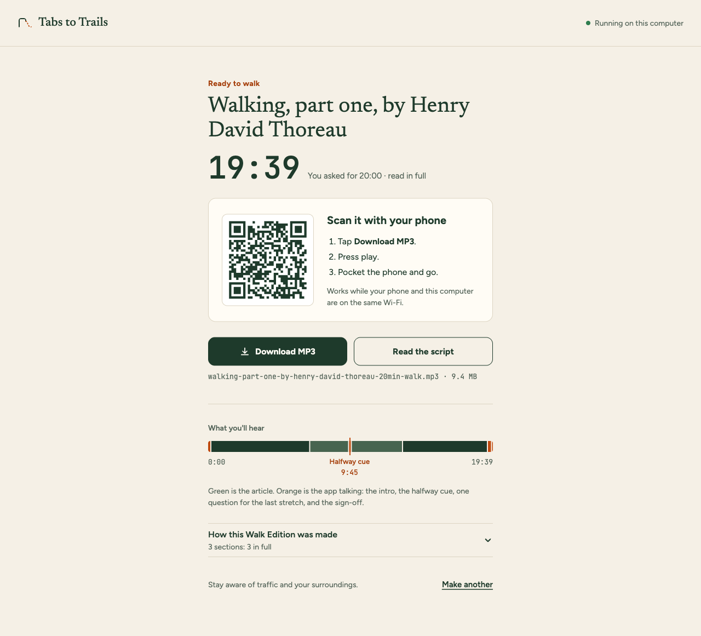
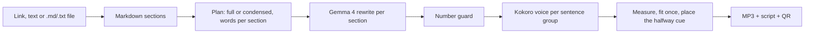

# Tabs to Trails

Turn your reading backlog into a walk.



You paste a link or some text and say how long your walk is. Your computer turns it into an MP3 of that length: Gemma 4 rewrites the text for listening and the Kokoro voice reads it, both running on your own machine. You scan a QR code, put the phone in your pocket and go.

The file holds everything the walk needs: a short intro, the piece itself, a chime and a cue at the halfway point so you know when to turn around, one question for the way home, and a sign-off. Once the file is on the phone, the walk needs nothing else.

Two samples, made with this repository, are on the [project page](https://nazboyko.github.io/tabs-to-trails/) and in [`samples/`](samples/).

## What makes it different

- **You bring the reading.** It is the article you already meant to read.
- **It is shaped by time.** Ask for 20 minutes and the app plans 20 minutes of speech from a measured reading speed, then shows the measured length of the result next to what you asked for.
- **It stays with the source.** Prose that fits is read as written. Gemma condenses only what does not fit, and a number guard checks every number in the rewrite against the source. The script view shows each section as Full, Condensed or Brief.

## Quick start

You need [Node.js](https://nodejs.org) 22 or newer and [Ollama](https://ollama.com).

1. `ollama pull gemma4:e4b` (a 6.6 GB download)
2. `npm ci` (this also fetches an ffmpeg binary)
3. `npm run build`
4. `npm start`

The app opens at http://localhost:8787. The first walk downloads the Kokoro voice (about 330 MB) and keeps it in `~/.cache/tabs-to-trails/models`. After that, a walk from pasted text needs no internet.

To get a walk onto your phone, keep the phone on the same Wi-Fi as the computer and scan the QR code on the Ready screen. Download is the main button there, because the phone leaves the Wi-Fi when you leave the house.

## How it works



1. **Read.** dev.to links go through the DEV API, without a challenge post's submission line and Prize Categories section. Other links are fetched once (http and https only, 10 seconds, 5 MB, 3 redirects, HTML only), parsed without running the page's scripts, and cleaned with Mozilla Readability. Reference lists and link lists are left out too, and the Ready screen names everything left out. Images are skipped unless their alt text states data, like a chart with its numbers; that alt text is then read as a sentence.
2. **Plan.** The text is split into sections by heading. The app measures once how fast the chosen voice speaks (characters per second on a fixed passage) and turns your walk length into a word budget. If the source fits, it is read in full. If not, Gemma rates how much each section matters, and the budget is split by length times importance.
3. **Rewrite.** In full mode Gemma only describes code and tables in a few sentences; prose is read as written. A table is told, not announced: "thinking off took 2.4 seconds", never "the numbers are listed". A description that announces gets one more try, and sentences that repeat the paragraph around the block are dropped. In condensed mode each section gets one request with its word target. A rewrite that runs well over or under its budget gets one more pass, and any shortfall or overshoot carries into the sections that follow.
4. **Guard.** Any number in a rewrite that is not in its source section sends the section back once with the number named. If it comes back again, the script marks it "Check this number".
5. **Voice.** Kokoro reads the script in sentence groups, each kept under the model's phoneme limit so nothing is cut off. The app measures the audio. If the walk runs more than 5% over, it shortens the largest condensed section; more than 8% under, it gives the time back to the condensed section that left out the most. It does this once and voices only that section again.
6. **Pack.** ffmpeg makes a chime from two sine tones and encodes a mono 64 kbps MP3. The halfway cue goes at the sentence boundary nearest the middle of the finished walk.

Every stage writes its result into `walks/<id>/`, so a build that stops (a crash, a closed laptop) picks up where it left off on the next start.

## Numbers from one laptop

Measured on an Apple M5 Max with 64 GB, `gemma4:e4b` through Ollama 0.35.1 with thinking off, Kokoro-82M at fp32 on the CPU.

| Source | Asked for | Measured | Halfway cue | Words in source / script | Model time | Voice time |
|---|---|---|---|---|---|---|
| The author's DEV post ([sample](samples/dev-post/)) | 10:00 | 10:15 | 5:11 | 1,726 / 1,531 | 4.1 s | 63.5 s |
| Thoreau, "Walking", part one ([sample](samples/thoreau-walking/)) | 20:00 | 19:39 | 9:45 | 3,160 / 3,160 | 3.7 s | 152 s |
| A code-heavy blog post | 10:00 | 9:22 | 4:36 | 2,147 / 1,210 | 12.5 s | 61.8 s |
| A Wikipedia article with tables | 10:00 | 9:56 | 4:47 | 1,451 / 1,085 | 4.9 s | 73 s |
| A long Wikipedia article | 20:00 | 18:42 | 9:24 | 8,007 / 2,391 | 42.5 s | 122.4 s |

The first two rows are the samples in this repository. The other three were measured while the rewrite was still being tuned, so a run today gives slightly different numbers. Kokoro reads about nine times faster than real time on this machine, so most of the waiting is the voice.

## Privacy

- The model and the voice run on your computer. The app sends nothing to a cloud service.
- The only outside requests the server makes are fetching the link you typed (or the DEV API for a dev.to link). Ollama downloads the model once and the voice weights download once from Hugging Face on the first walk.
- Paste mode works with the internet off once both are installed.
- The server listens on your local network so your phone can fetch the file. Only the phone page and its audio answer to other devices, and only with the walk's random token. Everything under `/api` answers only to this computer.
- Walks stay in the `walks/` folder until you delete it.

Use it for documents you are allowed to process on your own machine.

## Limitations

- A small model can still get things wrong. The number guard catches numbers that are not in the source; it does not catch a changed meaning. In one test a sentence ending "the kid screen got the time" came back as "the kid screen showed the time". Read the script for anything you plan to rely on.
- English only. The four voices are English, and the prompts are written for English text.
- Pages behind a login or built by scripts cannot be read. Paste the text instead.
- The length is planned, then measured; it is not exact. A source shorter than the walk is not padded: you get the shorter walk, and the Ready screen says so.
- The phone and the computer need the same Wi-Fi once, to get the file across.
- Tested on one Mac. Playback with a locked screen is up to the phone's browser; downloading the MP3 is the path that works everywhere.

## Settings

All optional, in `.env` or the environment:

| Name | Default | What it does |
|---|---|---|
| `PORT` | `8787` | Port of the app |
| `OLLAMA_URL` | `http://127.0.0.1:11434` | Where Ollama runs |
| `OLLAMA_MODEL` | `gemma4:e4b` | Any model Ollama serves; swap it here |
| `OLLAMA_NUM_CTX` | `16384` | Context size sent with every request |
| `VOICE` | `heart` | Default voice for the terminal: `heart`, `michael`, `emma`, `george` |
| `WALKS_DIR` | `walks` | Where walks are kept |
| `SHARE_HOST` | detected | Name or address the QR code points the phone to, for example `mylaptop.local`, when the detected network address is the wrong one |

## From the terminal

```
npm run walk -- https://dev.to/user/some-post --minutes 10
npm run walk -- notes.md --minutes whole --voice emma
```

The terminal and the app share the `walks/` folder, so a walk made in one shows up in the other.

## Development

```
npm run dev      # API server plus Vite with hot reload on http://localhost:5173
npm test         # vitest
npm run check    # type checks, tests and the web build
```

## Credits

- [Gemma 4](https://ai.google.dev/gemma) by Google, Apache-2.0, served by [Ollama](https://ollama.com) (MIT).
- [Kokoro-82M](https://huggingface.co/hexgrad/Kokoro-82M) by hexgrad, Apache-2.0, in its [ONNX build](https://huggingface.co/onnx-community/Kokoro-82M-v1.0-ONNX), run with [kokoro-js](https://github.com/hexgrad/kokoro) (Apache-2.0), [Transformers.js](https://github.com/huggingface/transformers.js) (Apache-2.0) and [ONNX Runtime](https://onnxruntime.ai) (MIT). Pronunciation through [phonemizer](https://github.com/xenova/phonemizer) (Apache-2.0), built on eSpeak NG.
- [Mozilla Readability](https://github.com/mozilla/readability) (Apache-2.0), [jsdom](https://github.com/jsdom/jsdom) (MIT), [turndown](https://github.com/mixmark-io/turndown) and its GFM plugin (MIT).
- [ffmpeg](https://ffmpeg.org) through [ffmpeg-static](https://github.com/eugeneware/ffmpeg-static) (GPL-3.0-or-later for the binary; the app runs it as a separate program).
- [Hono](https://hono.dev) (MIT), [React](https://react.dev) (MIT), [Vite](https://vite.dev) (MIT), [zod](https://zod.dev) (MIT), [qrcode](https://github.com/soldair/node-qrcode) (MIT).
- Fonts: [Newsreader](https://fonts.google.com/specimen/Newsreader), [Figtree](https://fonts.google.com/specimen/Figtree) and [JetBrains Mono](https://www.jetbrains.com/lp/mono/), all SIL Open Font License 1.1, bundled through Fontsource.
- The Thoreau sample uses "Walking" (1862) by Henry David Thoreau, a public-domain text, taken from Project Gutenberg with the distributor's header, footer and license removed.

## Contest note

Built for the DEV Hacktoberfest Open-Source AI Challenge, Week 1 "Touch Grass", between October 5 and 11, 2026. It enters the Best Use of Gemma category.

## License

MIT. See [LICENSE](LICENSE).
