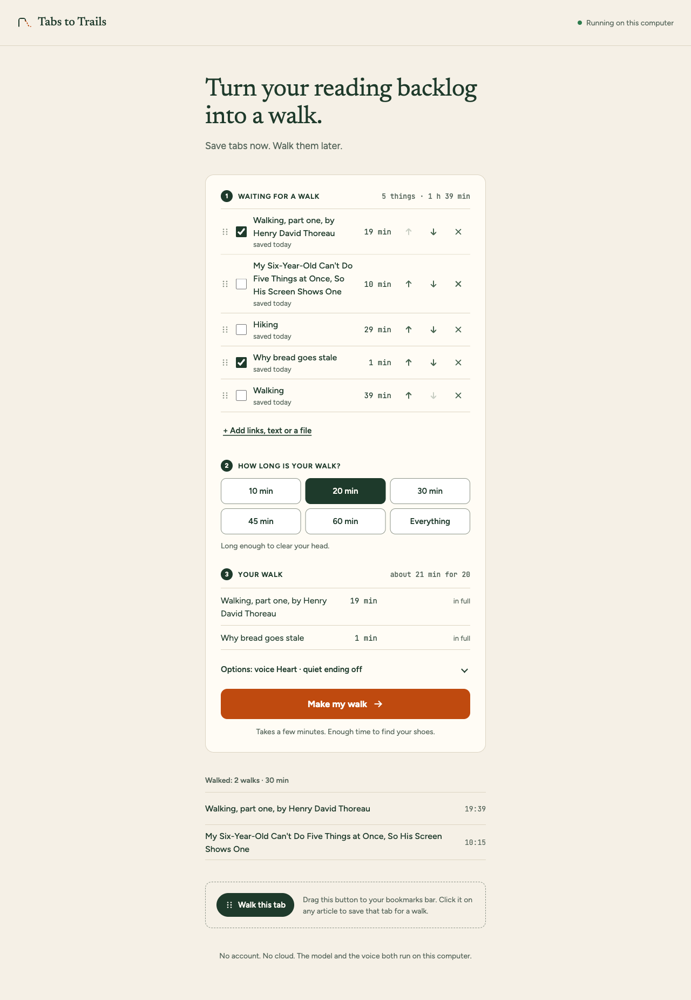

# Tabs to Trails

Turn your reading backlog into a walk.

**Save tabs now. Walk them later.**



Tabs to Trails keeps what you mean to read, measured in walking minutes. When you have twenty minutes, pick 20 and it proposes what fits. Your computer turns that into one MP3 of that length: Gemma 4 rewrites the text for listening and the Kokoro voice reads it, both on your own machine. You scan a QR code, put the phone in your pocket and go.

The file holds everything the walk needs: a short intro, the reading, a chime and a cue at the halfway point so you know when to turn around, one question for the way home, and a sign-off. Its chapters let the phone's own player resume and skip, and an audiobook copy (.m4b) is one tap away. Once the file is on the phone, the walk needs nothing else.

Two samples, made with this repository, are on the [project page](https://nazboyko.github.io/tabs-to-trails/), where you can read along while they play, and in [`samples/`](samples/).

Watch the demo video: [youtube.com/watch?v=ZHeU8dnJVQ8](https://www.youtube.com/watch?v=ZHeU8dnJVQ8). The article in it is ["Every Software Developer Has Blamed…"](https://dev.to/sylwia-lask/every-software-developer-has-blamed-3a1o) by Sylwia Laskowska.

## What makes it different

- **You bring the reading.** The list holds what you already meant to read. A bookmarklet saves the tab you are on in one click.
- **It is shaped by time.** You say how long the walk is; the app picks from the list and plans that many minutes of speech from the voice's measured pace, then shows the measured length next to what you asked for.
- **It stays with the source.** Prose that fits is read as written. Gemma condenses only what does not fit, and a number guard checks every number in the rewrite against the source. The script shows each section as Full, Condensed or Brief, with the sentence being spoken marked.

## Quick start

You need [Node.js](https://nodejs.org) 22 or newer and [Ollama](https://ollama.com).

1. `ollama pull gemma4:e4b` (a 6.6 GB download)
2. `npm ci` (this also fetches an ffmpeg binary)
3. `npm run build`
4. `npm start`

The app opens at http://localhost:8787. The first walk downloads the Kokoro voice (about 330 MB) and keeps it in `~/.cache/tabs-to-trails/models`. After that, a walk from pasted text, or from anything already in the list, needs no internet.

To get a walk onto your phone, keep the phone on the same Wi-Fi as the computer and scan the QR code on the Ready screen. Download is the main button there, because the phone leaves the Wi-Fi when you leave the house.

## Using it

1. **Save.** Paste links (one per line), some text or a .md or .txt file and press "Save for a walk", or drag "Walk this tab" to the bookmarks bar and click it on an article. Each link is fetched once, when you save it, and kept on this computer. A page behind a login shows "couldn't read" with "Paste the text instead" on its row.
2. **Pick a length.** 10 to 60 minutes, or Everything. The app ticks the rows that fit: the next part of a series first, then the oldest saved, as long as the total stays within the length plus 5%. If that fills less than 80% of the walk, it takes the set of up to 8 rows that comes closest to the length instead, keeping a next series part in it. Every row's minutes and the panel's minutes come from the chosen voice's measured pace, so the same piece shows the same number in both. "Your walk" shows how each piece will be read: in full, condensed from 27 minutes, or part 1 of 3, and how it adds up ("about 19 min for 20"). Tick or untick a row and the app keeps your choice. It does not pad: a short pick says "This is a 12-minute walk."
3. **Make the walk.** A few minutes later the Ready screen shows the measured length, the QR code and two downloads, MP3 and audiobook. The rows that went in leave the list ("2 tabs closed.").

A piece more than twice as long as the walk can become a series: "Split into 3 walks" puts three part rows in its place, and each part is its own walk that ends with "Part 2 is waiting for your next walk." Under Options there is a quiet ending: the reading stops one to three minutes early, says so, and you walk the rest in silence until the last chime. "Remind me" on the Ready screen makes a calendar file for your own calendar.

The script screen plays the walk with the sentence being spoken marked; click any sentence to start there. On the phone, "Find my place" lists the sections with their times, and a page reopened at home offers to continue where it stopped.

## How it works

```mermaid
flowchart LR
  A[Links, text or .md/.txt files] --> L[Walk list: read once, words and minutes]
  L --> P[Pick by length]
  P --> C[Plan: full or condensed, words per section]
  C --> D[Gemma 4 rewrite per section]
  D --> E[Number guard]
  E --> F[Kokoro voice per sentence group]
  F --> G[Measure, fit once, place the cues]
  G --> H[MP3 with chapters, timed script, QR]
```



1. **Read, at save time.** dev.to links go through the DEV API, without a challenge post's submission line and Prize Categories section. Other links are fetched once (http and https only, 10 seconds, 5 MB, 3 redirects, HTML only, at most three at a time), parsed without running the page's scripts, and cleaned with Mozilla Readability. Reference lists and link lists are left out, and the Ready screen names what was left out. Images are skipped unless their alt text states data, like a chart with its numbers. The Markdown is kept with the row, and the row shows its minutes, estimated from the voice's measured pace. A walk copies those files in when it starts, so a build needs no network and dead links cannot slow it down.
2. **Plan.** The text is split into sections by heading, and the walk length becomes a word budget. If the pieces fit, they are read in full. If not, each piece gets a share of the time in proportion to its length, Gemma rates how much each section matters, and the share is split by length times importance. The "Your walk" panel shows this same plan before anything is made. A series cuts a long read at section boundaries into parts of about one walk each.
3. **Rewrite.** In full mode Gemma only describes code and tables in a few sentences; prose is read as written. A table is told by its finding, for example "thinking off took 2.4 seconds", and a description that only says "the numbers are listed" gets one more try. In condensed mode each section gets one request with its word target; a rewrite well over or under gets one more pass, and the difference carries into the next sections of the same piece.
4. **Guard.** Any number in a rewrite that is not in its source section sends the section back once with the number named. If it comes back again, the script marks it "Check this number".
5. **Voice.** Kokoro reads the script in sentence groups, each kept under the model's phoneme limit so nothing is cut off. The app measures the audio. More than 5% over, it shortens the largest condensed section (a walk read in full condenses its least important one); more than 8% under, it gives the time back. It does this once; a walk that is still over says so, with its real length.
6. **Pack.** ffmpeg makes a chime from two sine tones and encodes a mono 64 kbps MP3 with one chapter per section. The halfway cue goes at the sentence boundary nearest the middle of the finished walk; walks of 45 minutes or more get a second cue near three quarters that says how many minutes are left. Between two pieces the voice says "Next:" and the title. The script gets a time for every sentence: the voice's own group boundaries, and inside a group the pause in the audio nearest each sentence start.

Every stage writes its result into `walks/<id>/`, so a build that stops (a crash, a closed laptop) picks up where it left off on the next start. The list lives in `walks/list/`.

## Numbers from one laptop

Measured on an Apple M5 Max with 64 GB, `gemma4:e4b` through Ollama 0.35.1 with thinking off, Kokoro-82M at fp32 on the CPU.

| Source | Asked for | Measured | Halfway cue | Words in source / script | Model time | Voice time |
|---|---|---|---|---|---|---|
| The author's DEV post ([sample](samples/dev-post/)) | 10:00 | 10:15 | 5:11 | 1,726 / 1,531 | 4.1 s | 63.5 s |
| Thoreau, "Walking", part one ([sample](samples/thoreau-walking/)) | 20:00 | 19:39 | 9:45 | 3,160 / 3,160 | 0.7 s | 159.2 s |
| A code-heavy blog post | 10:00 | 9:22 | 4:36 | 2,147 / 1,210 | 12.5 s | 61.8 s |
| A Wikipedia article with tables | 10:00 | 9:56 | 4:47 | 1,451 / 1,085 | 4.9 s | 73 s |
| A long Wikipedia article | 20:00 | 18:42 | 9:24 | 8,007 / 2,391 | 42.5 s | 122.4 s |
| Three pieces in one walk: the author's DEV post, Thoreau part one and Wikipedia's "Walking" (a fourth, dead link skipped) | 1:00:00 | 1:00:48 | 30:22 | 10,546 / 9,076 | 24.4 s | 382.6 s |

The first two rows are the samples in this repository. The next three were measured while the rewrite was still being tuned, so a run today gives slightly different numbers. The hour-long walk took 6 minutes 59 seconds from the command to the MP3, has its second cue at 45:26 ("About 15 minutes left."), and the file is 29.2 MB. Kokoro reads about nine times faster than real time on this machine, so most of the waiting is the voice.

A few more, from the same laptop:

- Six links saved at once: five answered within about a second (three read, two refused: a dead host and a login page); the sixth, an address that never answers, gave up at its 10-second limit.
- With every outside request blocked, a 10-minute walk built from a row saved earlier measured 10:07 and made no outside request.
- A 20-minute walk with 2 minutes of quiet measured 20:44; the reading ended at 18:18.
- The audiobook of the hour-long walk was made on request in 14.8 s: 31.0 MB, 29 chapters.
- Read-along: in the two samples, 231 of 232 sentence starts land on a pause of at least a quarter second in the voice, so a click plays from just before the first word.

## Privacy

- The model and the voice run on your computer. The app sends nothing to a cloud service.
- The only outside requests the server makes are fetching the links you save, once each (or the DEV API for a dev.to link). Ollama downloads the model once and the voice weights download once from Hugging Face on the first walk.
- Reminders are calendar files made on this computer. The app has no calendar access and sends nothing.
- Paste mode works with the internet off once both are installed.
- The server listens on your local network so your phone can fetch the file. Only the phone page and its audio answer to other devices, and only with the walk's random token. Everything under `/api` answers only to this computer.
- Walks and the walk list stay in the `walks/` folder until you delete it.

Use it for documents you are allowed to process on your own machine.

## Limitations

- A small model can still get things wrong. The number guard catches numbers that are not in the source; it does not catch a changed meaning. In one test a sentence ending "the kid screen got the time" came back as "the kid screen showed the time". Read the script for anything you plan to rely on.
- English only. The four voices are English, and the prompts are written for English text.
- Pages behind a login or built by scripts cannot be read. Paste the text instead.
- The length is planned, then measured; it is not exact. A source shorter than the walk is not padded: you get the shorter walk, and the screen says so.
- A series cuts at section ends, so the parts are not even, and an hour of Wikipedia at 20 minutes made four parts, not three.
- Chapters and the audiobook file were checked with ffmpeg and macOS's own audio tools, not yet on a phone's audiobook app. Whether a phone takes the reminder file over plain http on the home Wi-Fi is not tested yet.
- The phone and the computer need the same Wi-Fi once, to get the file across.
- Tested on one Mac. Playback with a locked screen is up to the phone's browser; downloading the MP3 is the path that works everywhere.

## Settings

All optional, in `.env` or the environment:

| Name | Default | What it does |
|---|---|---|
| `PORT` | `8787` | Port of the app |
| `OLLAMA_URL` | `http://127.0.0.1:11434` | Where Ollama runs |
| `OLLAMA_MODEL` | `gemma4:e4b` | Any model Ollama serves; swap it here |
| `OLLAMA_NUM_CTX` | `16384` | Context size sent with every request |
| `VOICE` | `heart` | Default voice for the terminal: `heart`, `michael`, `emma`, `george` |
| `WALKS_DIR` | `walks` | Where walks are kept |
| `SHARE_HOST` | detected | Name or address the QR code points the phone to, for example `mylaptop.local`, when the detected network address is the wrong one |

## From the terminal

```
npm run walk -- https://dev.to/user/some-post --minutes 10
npm run walk -- notes.md --minutes whole --voice emma
npm run walk -- https://example.com/one notes.md https://example.com/two --minutes 45
npm run walk -- notes.md --minutes 20 --quiet 2
```

Several sources make one walk, read in the order given. `--quiet` ends the reading that many minutes early.

The terminal and the app share the `walks/` folder, so a walk made in one shows up in the other.

## Development

```
npm run dev      # API server plus Vite with hot reload on http://localhost:5173
npm test         # vitest
npm run check    # type checks, tests and the web build
```

## Credits

- [Gemma 4](https://ai.google.dev/gemma) by Google, Apache-2.0, served by [Ollama](https://ollama.com) (MIT).
- [Kokoro-82M](https://huggingface.co/hexgrad/Kokoro-82M) by hexgrad, Apache-2.0, in its [ONNX build](https://huggingface.co/onnx-community/Kokoro-82M-v1.0-ONNX), run with [kokoro-js](https://github.com/hexgrad/kokoro) (Apache-2.0), [Transformers.js](https://github.com/huggingface/transformers.js) (Apache-2.0) and [ONNX Runtime](https://onnxruntime.ai) (MIT). Pronunciation through [phonemizer](https://github.com/xenova/phonemizer) (Apache-2.0), built on eSpeak NG.
- [Mozilla Readability](https://github.com/mozilla/readability) (Apache-2.0), [jsdom](https://github.com/jsdom/jsdom) (MIT), [turndown](https://github.com/mixmark-io/turndown) and its GFM plugin (MIT).
- [ffmpeg](https://ffmpeg.org) through [ffmpeg-static](https://github.com/eugeneware/ffmpeg-static) (GPL-3.0-or-later for the binary; the app runs it as a separate program).
- [Hono](https://hono.dev) (MIT), [React](https://react.dev) (MIT), [Vite](https://vite.dev) (MIT), [zod](https://zod.dev) (MIT), [qrcode](https://github.com/soldair/node-qrcode) (MIT).
- Fonts: [Newsreader](https://fonts.google.com/specimen/Newsreader), [Figtree](https://fonts.google.com/specimen/Figtree) and [JetBrains Mono](https://www.jetbrains.com/lp/mono/), all SIL Open Font License 1.1, bundled through Fontsource.
- The Thoreau sample uses "Walking" (1862) by Henry David Thoreau, a public-domain text, taken from Project Gutenberg with the distributor's header, footer and license removed.

## Contest note

Built for the DEV Hacktoberfest Open-Source AI Challenge, Week 1 "Touch Grass", between October 5 and 11, 2026. It enters the Best Use of Gemma category.

## License

MIT. See [LICENSE](LICENSE).
